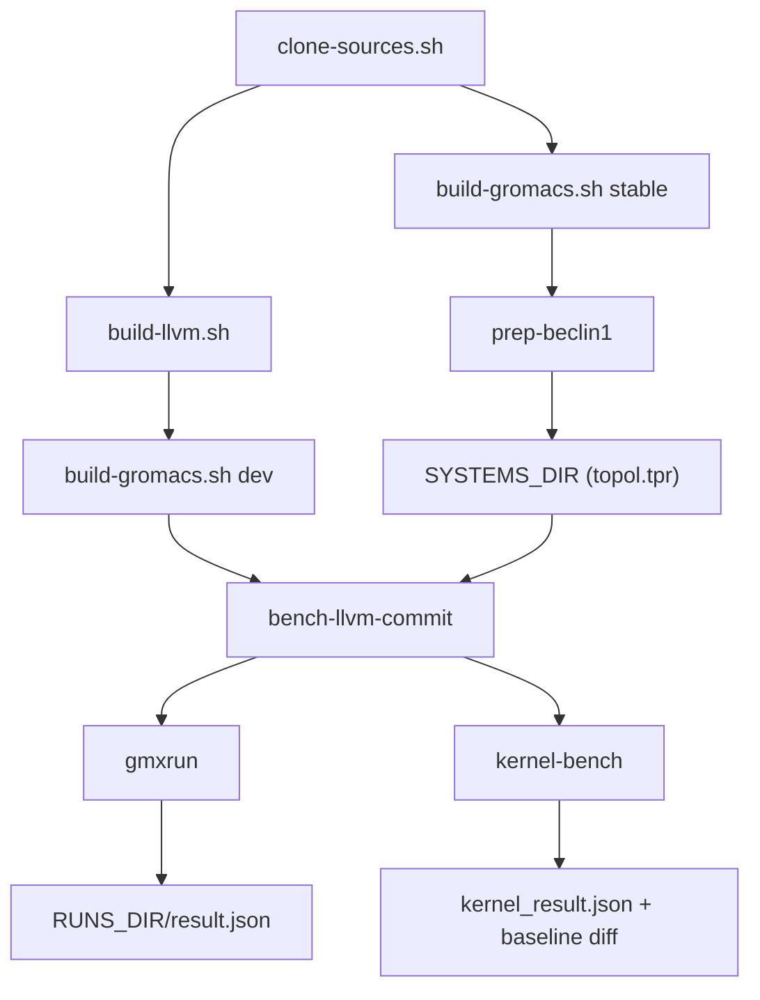

# gromacs-amdgpu

Tooling to improve GROMACS molecular-dynamics performance on AMD GPUs (RDNA4 /
`gfx1201`) by iterating on a custom LLVM. It builds a patched LLVM and a HIP
GROMACS against it, runs simulations, and diffs per-kernel GPU time and ns/day
against a stable ROCm-clang baseline.

Everything is driven by scripts in `scripts/` and one config file,
[config.sh](config.sh). All heavy, regenerable artifacts (source clones,
builds, installs, run outputs) live under a single work dir that defaults to
`.work/` inside this directory and is gitignored.

## What's tracked vs generated

Tracked in git: the scripts, [config.sh](config.sh), [versions.env](versions.env)
(pinned commits), the Beclin-1 input PDB + MDP templates under `systems/beclin1/`,
and the GROMACS source [patches](patches/). Everything else is generated into
`$WORK_DIR`.

## Prerequisites

- ROCm installed at `$ROCM_ROOT` (default `/opt/rocm/core-7.12`) with `hipcc`,
  `rocprofv3`, and an AMD GPU exposed to the machine.
- `cmake`, `ninja`, `git`, `python3`, `jq`, `awk`.
- A discrete GPU matching `$GPU_ARCH` (default `gfx1201`).
- For `genmovie` only: `ffmpeg` and `python3` with `pymol-open-source`.

## Configuration

`config.sh` defines every path with `: "${VAR:=default}"`, so any value can be
overridden from the environment. Key knobs:

| Variable | Default | Purpose |
|---|---|---|
| `WORK_DIR` | `./.work` | Root for all generated artifacts |
| `SRC_DIR` | `$WORK_DIR/src` | LLVM + GROMACS checkouts |
| `GMX_INSTALL_ROOT` | `$WORK_DIR/installs` | GROMACS install prefixes (was `/opt/gromacs`) |
| `RUNS_DIR` | `$WORK_DIR/runs` | Run outputs + `_systems/` inputs (was `/var/lib/gromacs-runs`) |
| `ROCM_ROOT` | `/opt/rocm/core-7.12` | ROCm toolchain root |
| `GPU_ARCH` | `gfx1201` | Target AMDGPU arch |
| `STABLE_BUILD` | `stable-rocm7.12` | Name of the ROCm-clang baseline install |

To reuse the historical system-wide layout instead of `.work/`:

```bash
export GMX_INSTALL_ROOT=/opt/gromacs RUNS_DIR=/var/lib/gromacs-runs
```

Optional secrets (e.g. `DISCORD_WEBHOOK_URL` for run notifications) go in an
ignored `.env` beside `config.sh`.

## Quickstart

```bash
cd gromacs-amdgpu

# 1. fetch the pinned LLVM + GROMACS forks and apply local patches
scripts/clone-sources.sh

# 2. build the custom LLVM (slow; incremental afterwards)
scripts/build-llvm.sh

# 3. build GROMACS: the dev build (custom LLVM) and the stable baseline
scripts/build-gromacs.sh dev
scripts/build-gromacs.sh stable

# 4. build the Beclin-1 benchmark systems (needs the stable build)
scripts/prep-beclin1
#    (for benchMEM/benchRIB, see systems/README.md)

# 5. establish baselines once, then benchmark a commit end-to-end
scripts/gmxrun       stable-rocm7.12 benchMEM baseline
scripts/kernel-bench stable-rocm7.12 benchMEM kernel-baseline
scripts/bench-llvm-commit --system benchMEM --tag my-optimization
```

## Scripts

| Script | Role |
|---|---|
| `clone-sources.sh` | Clone/refresh both forks at the pinned commits, apply `patches/` |
| `build-llvm.sh` | Configure + `ninja` build the custom LLVM |
| `build-gromacs.sh [dev\|stable]` | Configure, build, install GROMACS; `dev` repoints `dev-current` |
| `hipcc-dev` | `hipcc` wrapper forcing the custom LLVM toolchain |
| `gmxrun` | Run one simulation, write `result.json` (optional rocprof trace/compute) |
| `kernel-bench` | Run under `rocprofv3`, parse per-kernel GPU time, diff vs baseline |
| `bench-llvm-commit` | Rebuild LLVM+GROMACS, benchmark, stamp provenance, diff ns/day |
| `prep-beclin1` | Build the Beclin-1 em/nvt/npt systems from the shipped PDB |
| `genmovie` | Render a PyMOL+ffmpeg movie from a run's trajectory (`<run>/movie/movie.mp4`) |

## Workflow



## Run outputs

Each run lives at `$RUNS_DIR/<BUILD>__<SYSTEM>__<TAG>/` and contains the mdrun
trajectory/log, `wall.log`, `result.json` (ns/day, duration, commit provenance),
and — for profiled runs — `rocprof/` plus `kernel_result.json` (per-category GPU
time).
